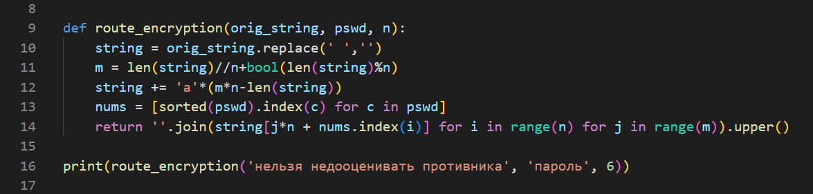
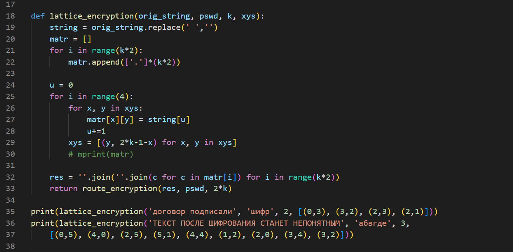
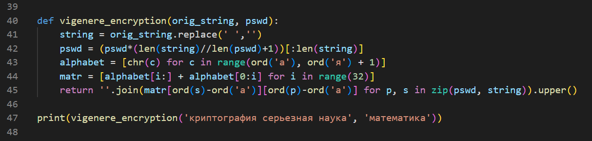

---
## Front matter
lang: ru-RU
title: "Лабораторная работа 2"
subtitle: "Шифры перестановки" 
author: "Греков Максим Сергеевич"
institute: RUDN University, Moscow, Russian Federation
date: 2022 Москва

## Formatting
mainfont: PT Serif
romanfont: PT Serif
sansfont: PT Serif
monofont: PT Serif
toc: false
slide_level: 2
theme: metropolis
header-includes: 
 - \metroset{progressbar=frametitle,sectionpage=progressbar,numbering=fraction}
 - '\makeatletter'
 - '\beamer@ignorenonframefalse'
 - '\makeatother'
aspectratio: 169
section-titles: true
---

# Цель работы 

## Цель работы

- Ознакомиться с шифрами перестановки.

- Реализовать маршрутное шифрование.

- Реализовать шифрование с помощью решеток.

- Реализовать шифрование Таблица Виженера.

# Описание методов

## Описание методов

Шифры перестановки преобразуют открытый текст в криптограмму путем перестановки его символов. 

Способ, каким при шифровании переставляются буквы открытого текста, и является ключом шифра. 

Важным требованием евс является равенство длин ключа и исходного текста.

# Маршрутное шифрование

## Описание 

Простейшим примеров перестановочного шифра являются так называемые «маршрутные перестановки», использующие некоторую геометрическую фигуру (плоскую или объемную). 

Шифрование заключается в том, что текст записывается в такую фигуру по некоторой траектории, а выписывается по другой траектории. (рис. -@fig:001)

## Реализация 

{ #fig:001 width=100% }

Результат: **ЕЕНПНЗОАТАЬОВОКННЕЬВЛДИРИЯЦТИА**

# Шифрование с помощью решеток

## Описание 

Выбирается число _k_. Строим квадрат со стороной длины k и заполняем его клетки числами от _1_ до _k^2_.

Поворачиваем квадрат на _90_ градусов по часовой стрелке и приписываем справа от исходного квадрата.

Поворачивая на _90_ градусов по часовой стрелки и добавляя полученный квадрат сначала снизу, а затем слева от предыдущего, получим квадрат со стороной _2k_.

В этом квадрате закрасим произвольным образом все цифры, причем каждая цифра может быть закрашена только один раз.

## Описание 

Это и будет решёткой для шифрования. 

Код для шифрования представляет последовательность _k_ цифр от _1_ до _4_, _i_-тая цифра обозначает в каком подквадрате (нумеруются в порядке создания) закрашивать число _i_.

Открытый текст разбивается на блоки длины _4k^2_. 

Каждый блок разбивается на подстроки длины _k^2_. 

Решетка накладывается на пустой лист бумаги, закрашиваемые клетки вырезаются. 

## Описание 

Для первой подстроки ее _i_-ый символ записывается в вырезанное _i_-ое число решетки. 

Повторяем процесс еще _3_ раза, поворачивая перед этим решетку на _90_ градусов по часовой стрелке. 

В результате получаем таблицу, составляющую из символов открытого текста. 

Криптограмма из этой таблицы получается путем построчного выписывания символов или применения приемов маршрутного шифрования. (рис. -@fig:002)

## Реализация 

{ #fig:002 width=100% }

## Реализация 

Результат 1: **ДПОРДАГВЛИИОСПОО**

Результат 2: **ЕФОСЕИШАТТРСОПНЛАНВЫНМНИТЯОСТПТЯКЕНЕ**

# Таблица Виженера

## Описание 

Шифр Виженера состоит из последовательности нескольких шифров Цезаря с различными значениями сдвига. (рис. -@fig:003)

Для зашифровывания может использоваться таблица алфавитов, называемая _tabula recta_ или квадрат (таблица) Виженера. 

Применительно к русскому алфавиту таблица Виженера составляется из строк по _33_ символов, причём каждая следующая строка сдвигается на несколько позиций. 

Таким образом, в таблице получается _33_ различных шифров Цезаря. 

На каждом этапе шифрования используются различные алфавиты, выбираемые в зависимости от символа ключевого слова. 

## Реализация 

{ #fig:003 width=100% }

Результат: **ЦРЪФЮОХШКФФЯГКЬЬЧПЧАЛНТШЦА**

# Вывод

## Вывод

- Ознакомились с шифрами перестановки.

- Реализовали маршрутное шифрование.

- Реализовали шифрование с помощью решеток.

- Реализовали шифрование Таблица Виженера.

## {.standout}