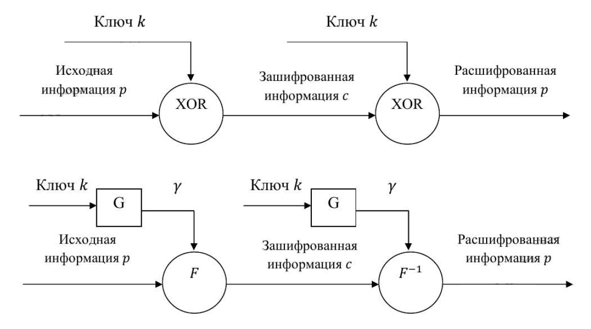
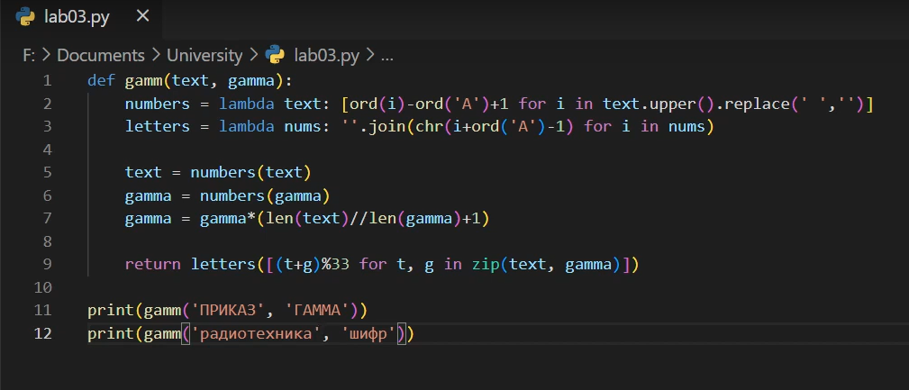

---
## Front matter
lang: ru-RU
title: "Лабораторная работа 3"
subtitle: "Шифрование гаммированием" 
author: "Греков Максим Сергеевич"
institute: RUDN University, Moscow, Russian Federation
date: 2022 Москва

## Formatting
mainfont: PT Serif
romanfont: PT Serif
sansfont: PT Serif
monofont: PT Serif
toc: false
slide_level: 2
theme: metropolis
header-includes: 
 - \metroset{progressbar=frametitle,sectionpage=progressbar,numbering=fraction}
 - '\makeatletter'
 - '\beamer@ignorenonframefalse'
 - '\makeatother'
aspectratio: 169
section-titles: true
---

# Цель работы 

## Цель работы

- Ознакомиться с шифрованием гаммированием.

- Исследовать стойкость шифров, основанных на процедуре гаммирования.

- Реализовать алгоритм шифрования гаммированием конечной гаммой.

# Описание метода

## Описание метода

**Гаммирование** – метод последовательного симметричного шифрования, суть которого состоит в том, что символы шифруемого текста последовательно складываются с символами некоторой специальной последовательности, которая называется гаммой. (рис. -@fig:001)

## Описание метода

{ #fig:001 width=70% }

## Стойкость

Стойкость шифров, основанных на процедуре гаммирования, зависит от характеристик гаммы - длины и равномерности распределения вероятностей появления знаков гаммы.

При использовании генератора ПСП получаем бесконечную гамму. 

Однако, возможен режим шифрования конечной гаммы. 

## Пример шифрования

В роли конечной гаммы может выступать фраза. 

Как и ранее, используется алфавитный порядок букв, т.е. буква _«а»_ имеет порядковый номер _1_, _«б»_ - _2_ и т.д.

Например, зашифруем слово _«ПРИКАЗ» (« 16 17 09 11 01 08»)_ гаммой _«ГАММА» («04 01 13 13 01»)_. 

## Пример шифрования

Будем использовать операцию побитового сложения по модулю 33 (mod 33). (рис. -@fig:002) Получаем:

$$c_1 = 16 + 4(mod 33) = 20$$
$$c_2 = 17 + 1(mod 33) = 18$$
$$c_3 = 9 + 13(mod 33) = 22$$

## Пример шифрования

$$c_4 = 11 + 13(mod 33) = 24$$
$$c_5 = 1 + 1(mod 33) = 2$$
$$c_6 = 8 + 4(mod 33) = 12$$

Криптограмма: _«УСХЧБЛ» (« 20 18 22 24 02 12»)_.

# Реализация

## Реализация

{ #fig:002 width=100% }

## Результат

- Результат 1: _УСХЧБЛ_

- Результат 2: _ИЙЩЩЖЫЪЕЕСЯС_

# Вывод

## Вывод

- Ознакомились с шифрованием гаммированием.

- Исследовали стойкость шифров, основанных на процедуре гаммирования.

- Реализовали алгоритм шифрования гаммированием конечной гаммой.

## {.standout}