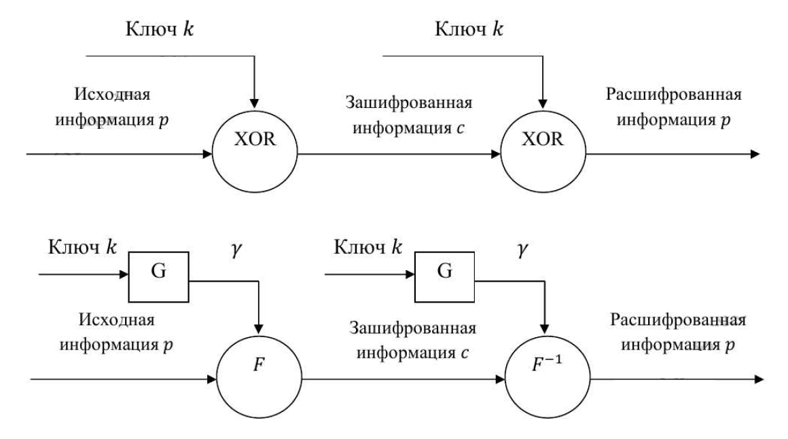
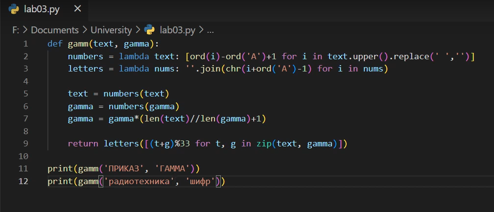

---
# Front matter
lang: ru-RU
title: "Лабораторная работа 3"
subtitle: "Шифрование гаммированием" 
author: "Греков Максим Сергеевич"

# Formatting
toc-title: "Содержание"
toc: true # Table of contents
toc_depth: 2
lof: true # List of figures
lot: false # List of tables
fontsize: 12pt
linestretch: 1.5
papersize: a4paper
documentclass: scrreprt
polyglossia-lang: russian
polyglossia-otherlangs: english
mainfont: PT Serif
romanfont: PT Serif
sansfont: PT Serif
monofont: PT Serif
mainfontoptions: Ligatures=TeX
romanfontoptions: Ligatures=TeX
sansfontoptions: Ligatures=TeX,Scale=MatchLowercase
monofontoptions: Scale=MatchLowercase
indent: true
pdf-engine: lualatex
header-includes:
  - \linepenalty=10 # the penalty added to the badness of each line within a paragraph (no associated penalty node) Increasing the value makes tex try to have fewer lines in the paragraph.
  - \interlinepenalty=0 # value of the penalty (node) added after each line of a paragraph.
  - \hyphenpenalty=50 # the penalty for line breaking at an automatically inserted hyphen
  - \exhyphenpenalty=50 # the penalty for line breaking at an explicit hyphen
  - \binoppenalty=700 # the penalty for breaking a line at a binary operator
  - \relpenalty=500 # the penalty for breaking a line at a relation
  - \clubpenalty=150 # extra penalty for breaking after first line of a paragraph
  - \widowpenalty=150 # extra penalty for breaking before last line of a paragraph
  - \displaywidowpenalty=50 # extra penalty for breaking before last line before a display math
  - \brokenpenalty=100 # extra penalty for page breaking after a hyphenated line
  - \predisplaypenalty=10000 # penalty for breaking before a display
  - \postdisplaypenalty=0 # penalty for breaking after a display
  - \floatingpenalty = 20000 # penalty for splitting an insertion (can only be split footnote in standard LaTeX)
  - \raggedbottom # or \flushbottom
  - \usepackage{float} # keep figures where there are in the text
  - \floatplacement{figure}{H} # keep figures where there are in the text
---

# Цель работы 

- Ознакомиться с шифрованием гаммированием.

- Исследовать стойкость шифров, основанных на процедуре гаммирования.

- Реализовать алгоритм шифрования гаммированием конечной гаммой.

# Описание метода

**Гаммирование** – метод последовательного симметричного шифрования, суть которого состоит в том, что символы шифруемого текста последовательно складываются с символами некоторой специальной последовательности, которая называется гаммой. (рис. -@fig:001)

{ #fig:001 width=70% }

## Стойкость

Стойкость шифров, основанных на процедуре гаммирования, зависит от характеристик гаммы - длины и равномерности распределения вероятностей появления знаков гаммы.

При использовании генератора ПСП получаем бесконечную гамму. 

Однако, возможен режим шифрования конечной гаммы. 

## Пример шифрования

В роли конечной гаммы может выступать фраза. 

Как и ранее, используется алфавитный порядок букв, т.е. буква _«а»_ имеет порядковый номер _1_, _«б»_ - _2_ и т.д.

Например, зашифруем слово _«ПРИКАЗ» (« 16 17 09 11 01 08»)_ гаммой _«ГАММА» («04 01 13 13 01»)_. 

Будем использовать операцию побитового сложения по модулю 33 (mod 33). (рис. -@fig:002) Получаем:

$$c_1 = 16 + 4(mod 33) = 20$$
$$c_2 = 17 + 1(mod 33) = 18$$
$$c_3 = 9 + 13(mod 33) = 22$$
$$c_4 = 11 + 13(mod 33) = 24$$
$$c_5 = 1 + 1(mod 33) = 2$$
$$c_6 = 8 + 4(mod 33) = 12$$

Криптограмма: _«УСХЧБЛ» (« 20 18 22 24 02 12»)_. 

# Реализация

{ #fig:002 width=100% }

- Результат 1: _УСХЧБЛ_

- Результат 2: _ИЙЩЩЖЫЪЕЕСЯС_

# Вывод

- Ознакомились с шифрованием гаммированием.

- Исследовали стойкость шифров, основанных на процедуре гаммирования.

- Реализовали алгоритм шифрования гаммированием конечной гаммой.