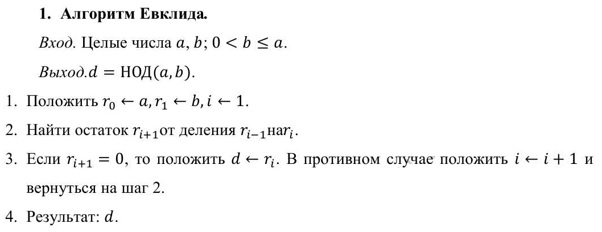
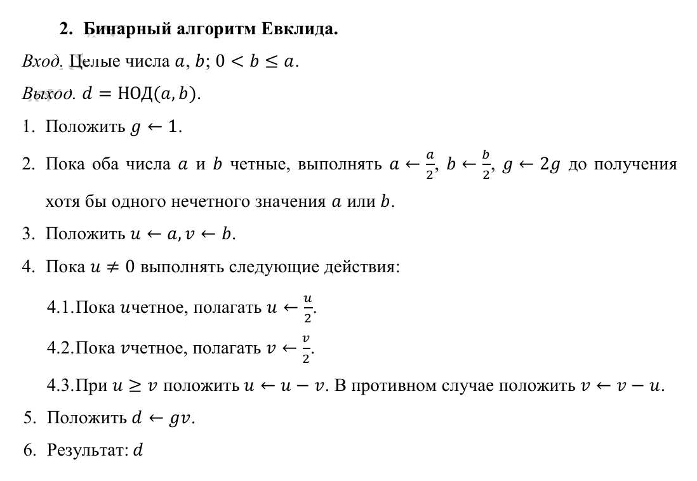
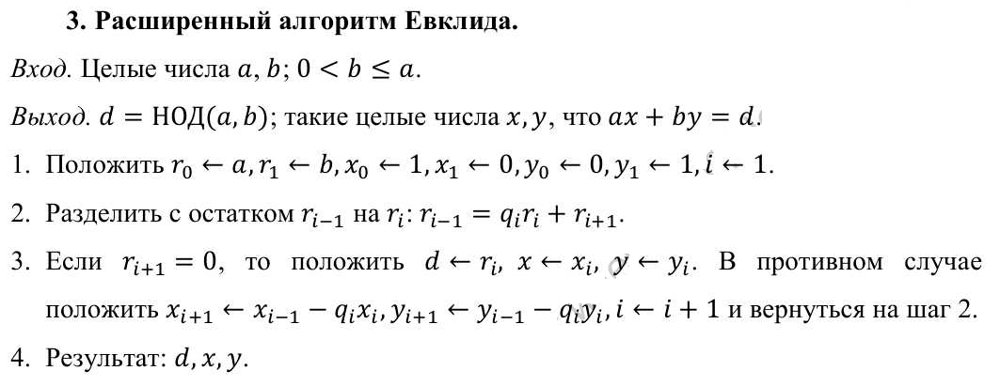
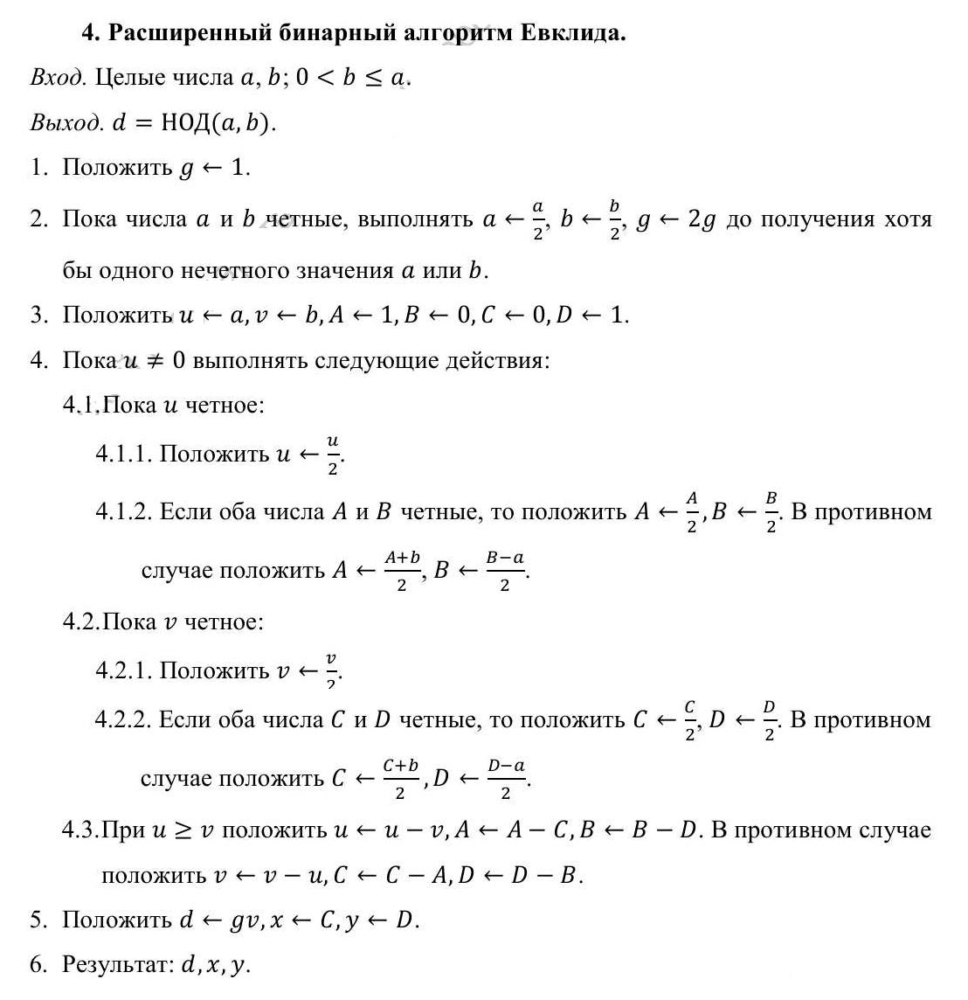
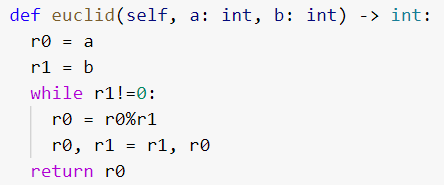
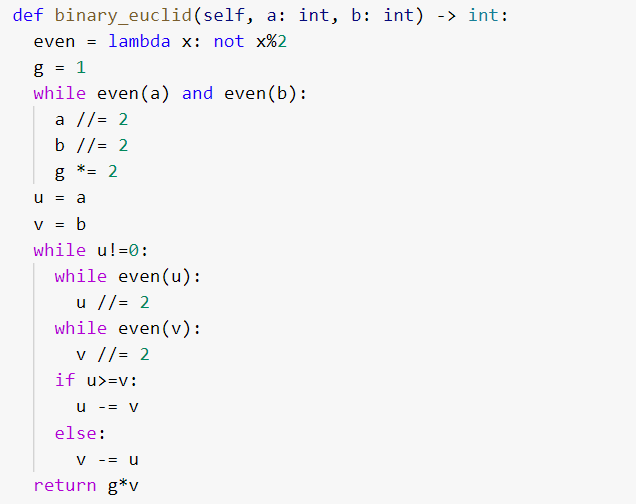
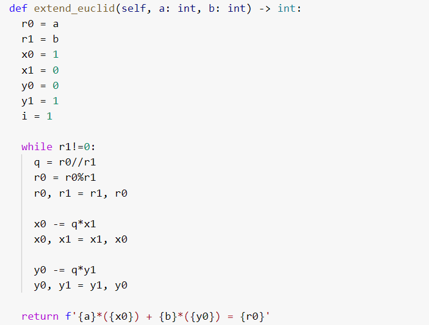
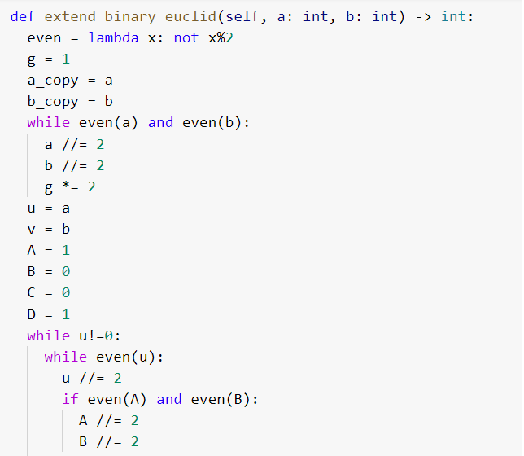
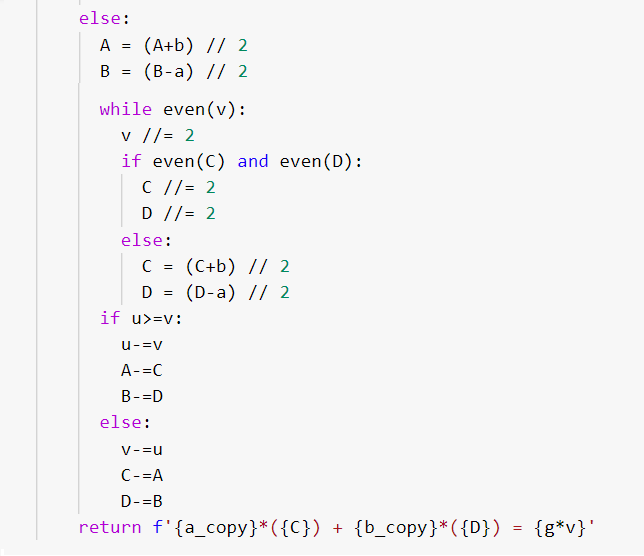
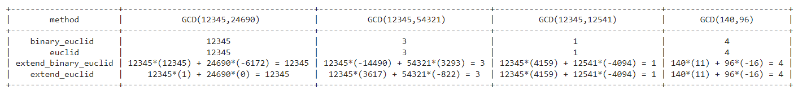

---
## Front matter
lang: ru-RU
title: "Лабораторная работа 4"
subtitle: "Вычисление наибольшего общего делителя" 
author: "Греков Максим Сергеевич"
institute: RUDN University, Moscow, Russian Federation
date: 2022 Москва

## Formatting
mainfont: PT Serif
romanfont: PT Serif
sansfont: PT Serif
monofont: PT Serif
toc: false
slide_level: 2
theme: metropolis
header-includes: 
 - \metroset{progressbar=frametitle,sectionpage=progressbar,numbering=fraction}
 - '\makeatletter'
 - '\beamer@ignorenonframefalse'
 - '\makeatother'
aspectratio: 169
section-titles: true
---

# Цель работы 

## Цель работы

- Ознакомиться с алгоритмами вычисления наибольшего общего делителя.

- Реализовать рассмотренные алгоритмы программно.

# Описание 

## Описание

Наибольшим общим делителем двух чисел _a_ и _b_ называется наибольшее число, на которое _a_ и _b_ делятся без остатка.

Для записи может использоваться аббревиатура _НОД_. Например:

- НОД(12345, 24690) = 12345

- НОД(12345, 54321) = 3

- НОД (12345, 12541) = 1

# Алгоритмы 

## Алгоритмы 

В данной работе будут рассматриваться следубщие алгоритмы вычисления наибольшего общего делителя:

- Алгоритм Евклида

- Бинарный алгоритм Евклида 

- Расширенный алгоритм Евклида

- Расширенный бинарный алгоритм Евклида

## Алгоритм Евклида

Для вычисления наибольшего общего делителя двух целых чисел применяется способ повторного деления с остатком, называемый алгоритмом Евклида (рис. -@fig:001), а также дополненную версию, называемую расширенным алгоритмом Евклида (рис. -@fig:003)

{ #fig:001 width=70% }

## Бинарный алгоритм Евклида 

Бинарный алгоритм Евклида (рис. -@fig:002) и его дополненная версия под названием расширенный алгоритм Евклида (рис. -@fig:004) являются более быстрыми при реализации на компьютере, поскольку используют двоичное представление чисел _а_ и _b_.

## Бинарный алгоритм Евклида 

{ #fig:002 width=70% }

## Расширенный алгоритм Евклида

{ #fig:003 width=70% }

## Расширенный бинарный алгоритм Евклида

{ #fig:004 width=40% }

# Реализация

## Алгоритм Евклида

{ #fig:005 width=70% }

## Бинарный алгоритм Евклида 

{ #fig:006 width=50% }

## Расширенный алгоритм Евклида

{ #fig:007 width=60% }

## Расширенный бинарный алгоритм Евклида

{ #fig:008 width=50% }

## Расширенный бинарный алгоритм Евклида

{ #fig:009 width=50% }

## Результат

{ #fig:010 width=100% }

# Вывод

## Вывод

- Ознакомились с алгоритмами вычисления наибольшего общего делителя.

- Реализовали рассмотренные алгоритмы программно.

## {.standout}