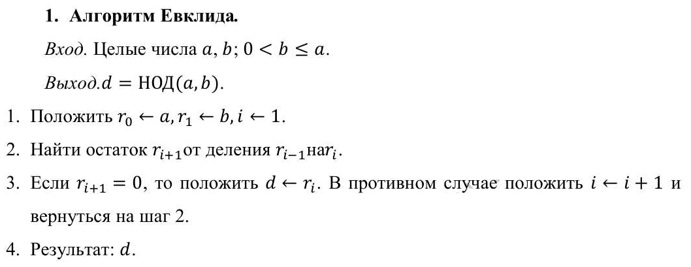
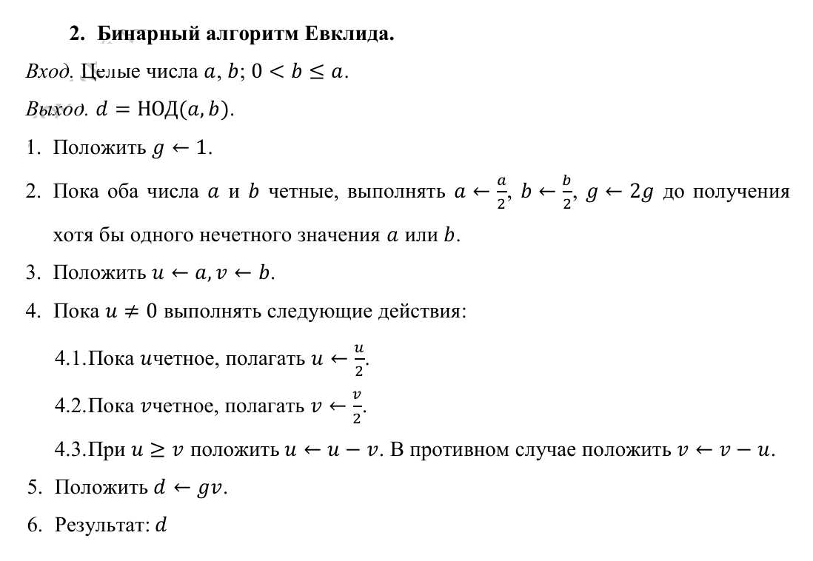
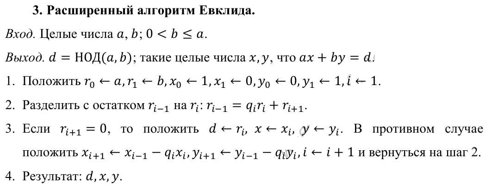
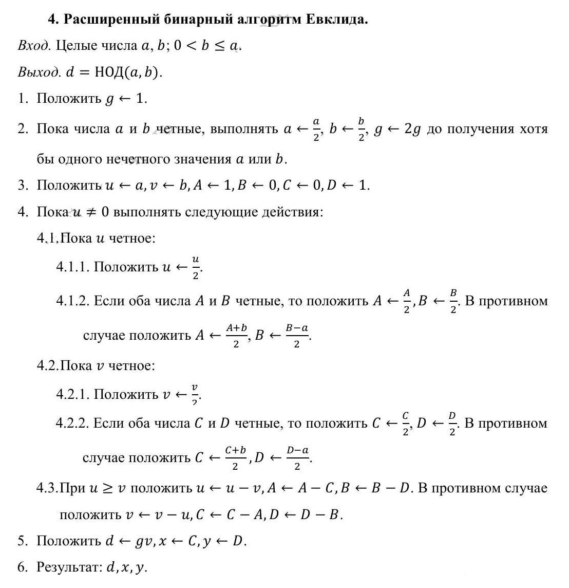
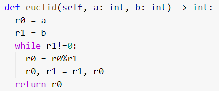
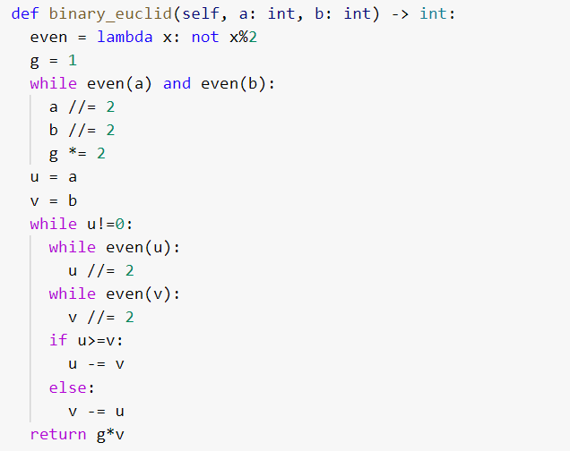
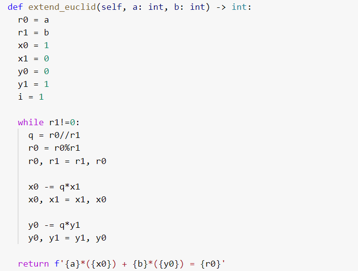
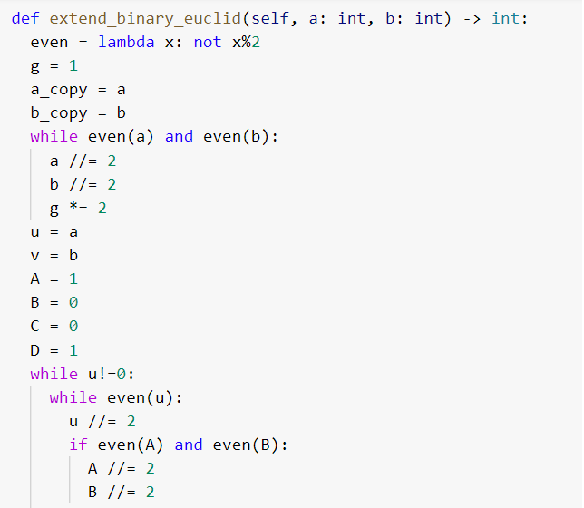
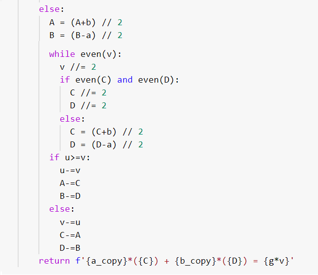
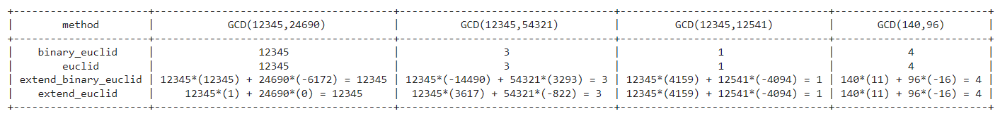

---
# Front matter
lang: ru-RU
title: "Лабораторная работа 4"
subtitle: "Вычисление наибольшего общего делителя" 
author: "Греков Максим Сергеевич"

# Formatting
toc-title: "Содержание"
toc: true # Table of contents
toc_depth: 2
lof: true # List of figures
lot: false # List of tables
fontsize: 12pt
linestretch: 1.5
papersize: a4paper
documentclass: scrreprt
polyglossia-lang: russian
polyglossia-otherlangs: english
mainfont: PT Serif
romanfont: PT Serif
sansfont: PT Serif
monofont: PT Serif
mainfontoptions: Ligatures=TeX
romanfontoptions: Ligatures=TeX
sansfontoptions: Ligatures=TeX,Scale=MatchLowercase
monofontoptions: Scale=MatchLowercase
indent: true
pdf-engine: lualatex
header-includes:
  - \linepenalty=10 # the penalty added to the badness of each line within a paragraph (no associated penalty node) Increasing the value makes tex try to have fewer lines in the paragraph.
  - \interlinepenalty=0 # value of the penalty (node) added after each line of a paragraph.
  - \hyphenpenalty=50 # the penalty for line breaking at an automatically inserted hyphen
  - \exhyphenpenalty=50 # the penalty for line breaking at an explicit hyphen
  - \binoppenalty=700 # the penalty for breaking a line at a binary operator
  - \relpenalty=500 # the penalty for breaking a line at a relation
  - \clubpenalty=150 # extra penalty for breaking after first line of a paragraph
  - \widowpenalty=150 # extra penalty for breaking before last line of a paragraph
  - \displaywidowpenalty=50 # extra penalty for breaking before last line before a display math
  - \brokenpenalty=100 # extra penalty for page breaking after a hyphenated line
  - \predisplaypenalty=10000 # penalty for breaking before a display
  - \postdisplaypenalty=0 # penalty for breaking after a display
  - \floatingpenalty = 20000 # penalty for splitting an insertion (can only be split footnote in standard LaTeX)
  - \raggedbottom # or \flushbottom
  - \usepackage{float} # keep figures where there are in the text
  - \floatplacement{figure}{H} # keep figures where there are in the text
---

# Цель работы 

- Ознакомиться с алгоритмами вычисления наибольшего общего делителя.

- Реализовать рассмотренные алгоритмы программно.

# Описание 

Наибольшим общим делителем двух чисел _a_ и _b_ называется наибольшее число, на которое _a_ и _b_ делятся без остатка.

Для записи может использоваться аббревиатура _НОД_. Например:

- НОД(12345, 24690) = 12345

- НОД(12345, 54321) = 3

- НОД (12345, 12541) = 1

# Алгоритмы 

В данной работе будут рассматриваться следубщие алгоритмы вычисления наибольшего общего делителя:

- Алгоритм Евклида

- Бинарный алгоритм Евклида 

- Расширенный алгоритм Евклида

- Расширенный бинарный алгоритм Евклида

## Алгоритм Евклида

Для вычисления наибольшего общего делителя двух целых чисел применяется способ повторного деления с остатком, называемый алгоритмом Евклида (рис. -@fig:001), а также дополненную версию, называемую расширенным алгоритмом Евклида (рис. -@fig:003)

{ #fig:001 width=70% }

## Бинарный алгоритм Евклида 

Бинарный алгоритм Евклида (рис. -@fig:002) и его дополненная версия под названием расширенный алгоритм Евклида (рис. -@fig:004) являются более быстрыми при реализации на компьютере, поскольку используют двоичное представление чисел _а_ и _b_.

{ #fig:002 width=70% }

## Расширенный алгоритм Евклида

{ #fig:003 width=70% }

## Расширенный бинарный алгоритм Евклида

{ #fig:004 width=40% }

# Реализация

## Алгоритм Евклида

{ #fig:005 width=70% }

## Бинарный алгоритм Евклида 

{ #fig:006 width=50% }

## Расширенный алгоритм Евклида

{ #fig:007 width=60% }

## Расширенный бинарный алгоритм Евклида

{ #fig:008 width=50% }

{ #fig:009 width=50% }

## Результат

{ #fig:010 width=100% }

# Вывод

- Ознакомились с алгоритмами вычисления наибольшего общего делителя.

- Реализовали рассмотренные алгоритмы программно.
