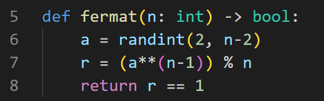
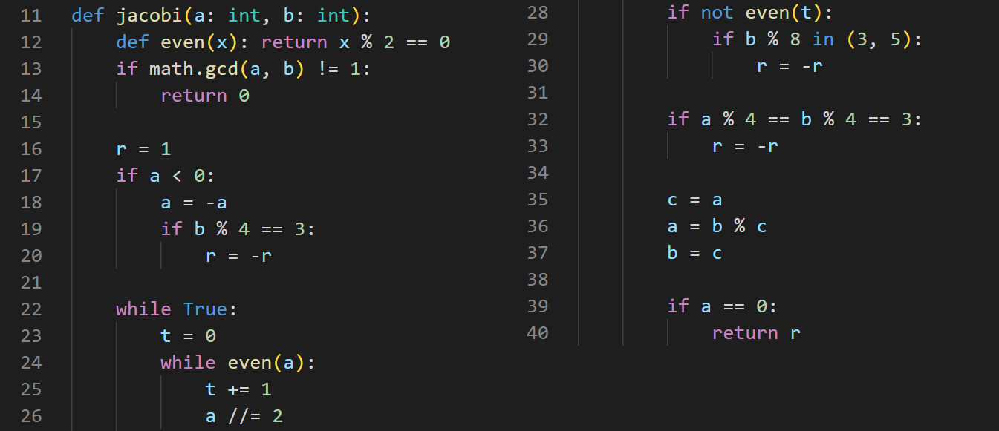
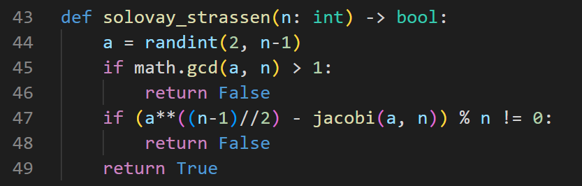
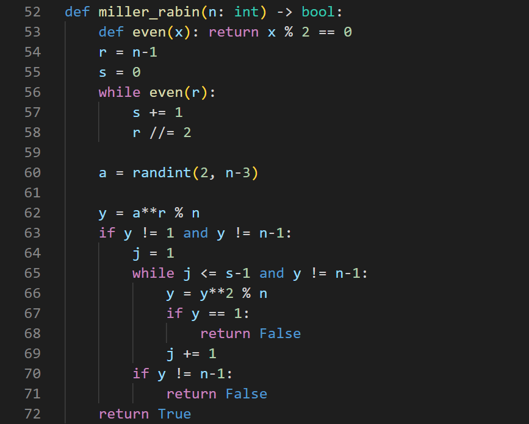
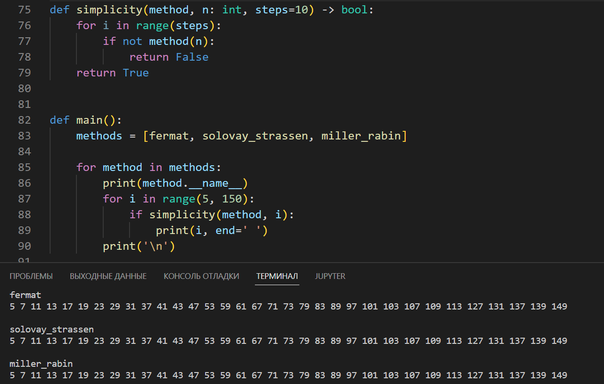

---
## Front matter
lang: ru-RU
title: "Лабораторная работа 5"
subtitle: "Вероятностные алгоритмы проверки чисел на простоту" 
author: "Греков Максим Сергеевич"
institute: RUDN University, Moscow, Russian Federation
date: 2022 Москва

## Formatting
mainfont: PT Serif
romanfont: PT Serif
sansfont: PT Serif
monofont: PT Serif
toc: false
slide_level: 2
theme: metropolis
header-includes: 
 - \metroset{progressbar=frametitle,sectionpage=progressbar,numbering=fraction}
 - '\makeatletter'
 - '\beamer@ignorenonframefalse'
 - '\makeatother'
aspectratio: 169
section-titles: true
---

# Цель работы 

## Цель работы

- Ознакомиться с определением простых чисел 

- Изучить свойства простых чисел и подходы к их обнаружению

- Реализовать вероятностные алгоритмы проверки чисел на простоту

# Описание 

## Простое число 

Пусть а - целое число. Числа ±1, ±а называются тривиальными делителями числа а.

Целое число р называется простым, если оно не является делителем единицы и не имеет других делителей, кроме тривиальных. 

В противном случае число р называется составным. 

Например, числа ±2, ±3, ±5, ±7,±11,±13,±17,±19,±23,±29 являются простыми.

## Проверка на простоту 

Проверка чисел на простоту является составной частью алгоритмов генерации простых чисел, применяемых в криптографии с открытым ключом.

Алгоритмы проверки на простоту можно разделить на вероятностные и детерминированные.

## Типы алгоритмов

Детерминированный алгоритм всегда действует по одной и той же схеме и гарантированно решает поставленную задачу (или не дает никакого ответа). 

Вероятностный алгоритм использует генератор случайных чисел и дает не гарантированно точный ответ. 

## Вероятностные алгоритмы

Вероятностные алгоритмы в общем случае не менее эффективны, чем детерминированные (если используемый генератор случайных чисел всегда дает набор одних и тех же чисел, зависящих от входных данных, то вероятностный алгоритм становится детерминированным).

Для проверки на простоту числа n вероятностным алгоритмом выбирают случайное число а (1 < a < n) и проверяют условия алгоритма. 

Если число n не проходит тест по основанию а, то алгоритм выдает результат «Число n составное», и число n действительно является составным.

## Количество тестов

Если же n проходит тест по основанию а, ничего нельзя сказать о том, действительно ли число n является простым. 

Последовательно проведя ряд проверок таким тестом для разных а и получив для каждого из них ответ «Число n, вероятно, простое», можно утверждать, что число n является простым с вероятностью, близкой к 1.

Рассмотрим такие вероятностные алгоритмы как тест Ферма (рис. -@fig:001), Соловэя-Штрассена (рис. -@fig:003) (а также алгоритм вычисления символа Якоби (рис. -@fig:002)), Миллера-Рабина (рис. -@fig:004), и выполним с их помощью проверки (рис. -@fig:005).

# Алгоритмы

## Тест Ферма

{ #fig:001 width=100% }

## Вычисление символа Якоби

{ #fig:002 width=100% }

## Тест Соловэя-Штрассена

{ #fig:003 width=100% }

## Тест Миллера-Рабина

{ #fig:004 width=55% }

# Результаты

## Результаты

{ #fig:005 width=75% }

# Выводы

## Выводы

- Ознакомились с определением простых чисел 

- Изучили свойства простых чисел и подходы к их обнаружению

- Реализовали вероятностные алгоритмы проверки чисел на простоту

## {.standout}

